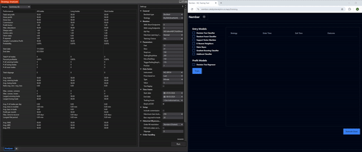
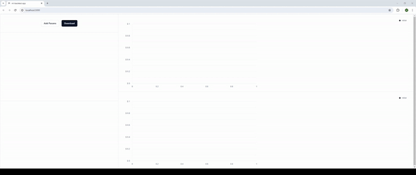

# 👋 Hey there! I'm Maxwell Mendenhall

### 🧑‍💻 Computer Science | White Collar Crime | Computer Security

Welcome to my GitHub portfolio! Here, you'll find a selection of projects that highlight my work in machine learning, software development, website design, and stock trading. With each project, I strive to create impactful solutions that meet both technical and business needs.

---

## 🚀 Featured Projects

### 1. **ML-Backtest Library**
A Python library for running machine learning backtests, designed to streamline the process of testing and evaluating trading strategies.

**Tech Stack**: Python

**Highlights**:
- **Simple Installation**: Install via pip for quick setup: pip install ml-backtest
- **Powerful Backtesting**: Includes robust tools for testing strategies with machine learning.
- **Documentation & Support**: Comprehensive guides to get you started quickly.

[Explore Nember](https://nember.catalystanalytics.io)

---

### 2. **ML-Backtest App**
A no-code, Docker-deployed app for running backtests using the ML-Backtest Python library, simplifying machine learning backtesting for non-coders.

**Tech Stack**: Python, Docker

**Features**:
- **Easy Deployment**: Get started with backtesting in a few clicks.
- **Machine Learning Integration**: Supports ML-based strategy testing for optimized results.

[Explore ML-Backtest App](https://github.com/MaxwellMendenhall/backtest-with-machine-learning)

---

### 3. **Tailored Film Studio**
Developed a website that boosted customer reach for a local business, attracting over 50 new customers per week.

**Tech Stack**: Vue.js, Python, and Docker

**Features**:
- **Enhanced Customer Engagement**: Intuitive UI design focused on user engagement.
- **High-Conversion Design**: Features designed to attract and retain customers.

[Explore Tailored Film Studio](https://tailoredfilmstudio.com/)

---

## 🌱 Current Studies
- **Computer Science**
- **White Collar Crime**
- **Computer Security**

I'm constantly looking to expand my skill set and take on challenging projects that merge technology with real-world impact.

---

Thank you for stopping by! Feel free to explore my work, star a project, or reach out to chat about tech, trading, and AI! 😊

